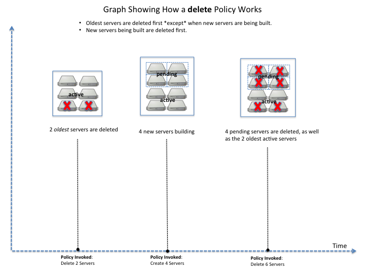
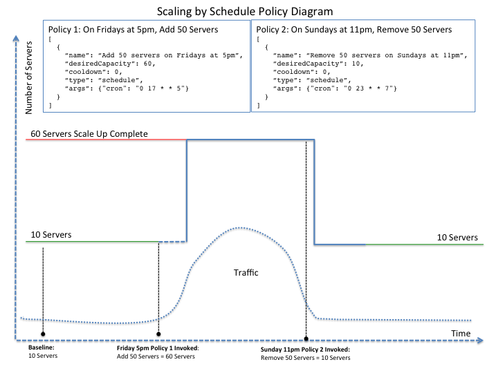

.. _concepts:

Autoscale concepts
--------------------

To use the Autoscale API effectively, you should understand several key concepts,
discussed in this chapter.

.. _how-it-works:

How Autoscale works
~~~~~~~~~~~~~~~~~~~~~

Rackspace Autoscale is an API-based tool that automatically scales
resources in response to an increase or decrease in overall workload
based on user-defined thresholds.

Autoscale calls the Rackspace Cloud Servers,
Rackspace Cloud Load Balancers, and Rackspace RackConnect v3 APIs. All
Rackspace Cloud Server create server configuration parameters can be
used with Autoscale. For more information, see the following documentation:

-  `Rackspace Cloud Servers documentation`_
-  `public Autoscale github documentation`_
-  `public Autoscale github Wiki`_

Autoscale functions by linking these services:

-  Rackspace Cloud Servers. Learn more at `Cloud Servers Getting Started Guide`_

-  Load-balanced Cloud Servers. Learn more at `Load Balancers Getting Started Guide`_.

You can set up a schedule for launching Autoscale or define an event
that triggers a webhook. You can also specify a minimum and maximum
number of cloud servers for your scaling group, the amount of resources
you want to increase or decrease, and policies based on percentage or
real numbers.

..  note::
       -  Autoscale does not configure any information within a server. You must configure your services
          to function when each server is started. We recommend automating your servers' startup processes
          with `Chef`_ or a similar tool.

       - Autoscale can use all Rackspace Cloud Server create server API
         parameters. For more details, see the `Create servers`_  documentation.

.. _Cloud Servers Getting Started guide: http://docs.rackspace.com/servers/api/v2/cs-gettingstarted/content/overview.html
.. _public Autoscale github Wiki: https://github.com/rackerlabs/otter/wiki
.. _public Autoscale github documentation: https://github.com/rackerlabs/otter/tree/master/doc
.. _Rackspace Cloud Servers documentation: http://docs.rackspace.com/
.. _Load Balancers Getting Started Guide: http://docs.rackspace.com/loadbalancers/api/v1.0/clb-getting-started/content/LB_Overview.html
.. _Chef: http://www.opscode.com/chef/
.. _Create servers: http://docs.rackspace.com/servers/api/v2/cs-devguide/content/CreateServers.html

.. _scaling-groups:

Scaling groups
~~~~~~~~~~~~~~

The scaling group is at the heart of an Autoscale deployment. The
scaling group specifies the basic elements of the Autoscale
configuration. It manages how many servers can participate in the
scaling group. It also specifies information related to load balancers
if your configuration uses a load balancer.

When you create a scaling group, you specify the details for group
configurations and launch configurations.

+----------------------+-----------------------------------------------------------------------------------------------------------------------------------------------------------------------------------------------------------------------------------------------------------------------------------------------------------------------+
| Configuration        | Description                                                                                                                                                                                                                                                                                                           |
+======================+=======================================================================================================================================================================================================================================================================================================================+
| Group Configuration  | Outlines the basic elements of the Autoscale configuration. The group configuration manages how many servers can participate in the scaling group. It sets a minimum and maximum limit for the number of entities that can be used in the scaling process. It also specifies information related to load balancers.   |
+----------------------+-----------------------------------------------------------------------------------------------------------------------------------------------------------------------------------------------------------------------------------------------------------------------------------------------------------------------+
| Launch Configuration | Creates a blueprint for how new servers will be created. The launch configuration specifies what type of server image will be started on launch, what flavor the new server is, and which cloud load balancer or RackConnect v3 load balancer pool the new server connects to.                                        |
|                      | Note: The launchConfiguration uses the admin user to scale up, usually the first admin user found on the tenant. Only that particular admin user's SSH key pair names can be used in the launchConfiguration.                                                                                                         |
|                      | Note: The launchConfiguration update operation overwrites all launchConfiguration settings.                                                                                                                                                                                                                           |
+----------------------+-----------------------------------------------------------------------------------------------------------------------------------------------------------------------------------------------------------------------------------------------------------------------------------------------------------------------+

The launch configuration specifies the launch type along with server and load balancer configuration for the components to start. Most launch configurations have both a server and a load balancer (can be RackConnect v3) configured as shown in the `Launch configuration examples`_ .

``type``
     Set the type parameter to this value: ``launch_server``.

``args``
        Specifies the configuration for server and load balancers. Most launch
        configurations have both a server and a
        load balancer (can be RackConnect v3) configured. The following items can be configured:

        ``server``
             Specifies configuration information for the Cloud server
             image that will be created during the scaling process. If you are using Boot From
             Volume, the ``server`` args are where you specify your create server
             template. See :ref:`Server parameters <server-parameters>`.

        ``loadbalancers``
             Specifies the configuration information for the load balancer(s) used in
             the cloud server deployment, including a RackConnect v3 load balancer
             pool. For background information and an example configuration, see :ref:`Cloud Bursting with RackConnect
             v3 <cloud-bursting>`.

             .. note::
                You must include the ``ServiceNet`` network in your configuration
                if you use a load balancer so the load balancer can retrieve the IP address of new
                servers. See :ref:`Load balancer parameters <load-balancers-parameters>`.

        ``draining_timeout``
             Specifies the number of seconds Autoscale will put the CLB node in DRAINING mode
             before deleting the node and eventually the server. This is used when scaling down.
             Not used when there is no ``loadbalancers`` configuration. Please note that
             this feature only works with a cloud load balancer.

Each scaling group has an associated ``status`` that represents the health of the
group. When the group is successfully able to launch servers and optionally add
them to load balancers then the status is ``ACTIVE``. If the scaling group cannot
launch servers because of an error that requires user attention,
the status changes to ``ERROR``. In this case, the :ref:`group state <get-group-state>`
contains a list of human-readable messages that explain the conditions that caused the error.
After you fix the errors, you can restore the group to ``ACTIVE`` state by submitting a
:ref:`converge <trigger-convergence>` or :ref:`execute policy <execute-policy>`
API request.

.. _server-parameters:

Server parameters
^^^^^^^^^^^^^^^^^^^^

Specifies configuration information for the Cloud server image that will
be created during the scaling process. If you are using Boot From
Volume, the ``server`` args are where you specify your create server template.

The ``server`` group parameter specifies details about the server as
described in the following table. Note the ``server`` arguments are
directly passed to nova when creating a server.

**Parameter name and description**

``name``
     Specifies a prefix to the name for created servers. The name of new
     servers will be automatically generated using the following formula:
     ``[serverName]-AS[uniqueHash]``, and will look similar to the following:
     ``[serverName]-AS12fabe``. The name of new servers may be truncated to fit
     within the limit of 255 characters.

``flavorRef``
     Specifies the flavor id for the server, ``performance1-4`` for example.
     A flavor is a resource configuration for a server. For details,
     see `Server flavors`_.

``imageRef``
     Specifies the ID of the Cloud Server image to start,
     ``0d589460-f177-4b0f-81c1-8ab8903ac7d8`` for example.

``OS-DCF:diskConfig``
     Specifies how the disk on new servers is partitioned. Valid values are
     ``AUTO`` or ``MANUAL``. For non-Rackspace server images, this value
     must always be ``MANUAL``. A non-Rackspace server image would be one
     that you imported using a non-Rackspace server. For more information,
     see the `Disk Configuration`_  documentation for
     Rackspace Cloud Servers.

``metadata``
    Optional. The maximum size of the metadata key and value is 255 bytes
    each. For details, see the `Server Metadata`_
    documentation for Rackspace Cloud Servers. You use this attribute to
    `configure RackConnect v2 with Autoscale Cloud
    Bursting Using Autoscale, RackConnect, and F5 Load Balancers`_.

    Do not use this parameter to configure Autoscale and RackConnect
    v3, use the ``loadBalancers`` parameter instead.

``networks``
    Specifies the networks to which you want to attach the server. This
    attribute enables you to attach to an isolated network for your tenant
    ID, the public Internet, and the private ServiceNet. If you do not
    specify any networks, your server is attached to the public Internet and
    private ServiceNet. The UUID for the private ServiceNet is
    ``11111111-1111-1111-1111-111111111111``. The UUID for the public Internet
    is ``00000000-0000-0000-0000-000000000000``.

``personality``
    Specifies the file path or the content to inject into a
    server image. See the `Server Personality`_ documentation for Rackspace Cloud Servers.

``user_data``
    Specifies the base64 encoded create server template that you use to Boot
    from Volume. For details, see the `Config-Drive Extension`_
    section of the *Next Generation Cloud Servers Developer Guide*. For more
    information on Boot from Volume, see the developer blog
    `Using Cloud Init with Rackspace Cloud`_.

.. _Server flavors: http://docs.rackspace.com/servers/api/v2/cs-devguide/content/server_flavors.html
.. _Disk Configuration: http://docs.rackspace.com/servers/api/v2/cs-devguide/content/diskconfig_attribute.html
.. _Server Metadata: http://docs.rackspace.com/servers/api/v2/cs-devguide/content/Server_Metadata-d1e2529.html
.. _configure RackConnect v2 with Autoscale Cloud Bursting Using Autoscale, RackConnect, and F5 Load Balancers: http://www.rackspace.com/knowledge_center/article/cloud-bursting-using-auto-scale-rackconnect-and-f5-load-balancers
.. _Server Personality: http://docs.rackspace.com/servers/api/v2/cs-devguide/content/Server_Personality-d1e2543.html
.. _Config-Drive Extension: http://docs.rackspace.com/servers/api/v2/cs-devguide/content/config_drive_ext.html
.. _Using Cloud Init with Rackspace Cloud: https://developer.rackspace.com/blog/using-cloud-init-with-rackspace-cloud/

.. _load-balancers-parameters:

Load balancer parameters
^^^^^^^^^^^^^^^^^^^^^^^^^^

Load balancer parameters specify the configuration information for the load balancer(s) used in
the cloud server deployment, including a RackConnect v3 load balancer
pool. For background information and an example configuration, see :ref:`Cloud Bursting with RackConnect
v3 <cloud-bursting>`. Please note that you must
include the ``ServiceNet`` network in your configuration if you use a
load balancer so the load balancer can retrieve the IP address of new
servers.

**Parameter name and description**

``loadBalancerId``
    Specifies the ID of the load balancer that is automatically generated
    when the load balancer is created.

``port``
    The server port for receiving traffic from the load balancer, often poirt 80.

    .. note::
    	  You can get information about your load balancer from the Control Panel
      	  or by using `List Load Balancer Details`_.

 .. _List Load Balancer Details: http://docs.rackspace.com/loadbalancers/api/v1.0/clb-getting-started/content/List_LB_Details.html

.. _launch-config-examples:

Launch configuration examples
^^^^^^^^^^^^^^^^^^^^^^^^^^^^^^

The following example shows a launch configuration of type
"launch\_server" for a cloud server and a load balancer:

**Example: Launch configuration**

.. code::  sh

    {
        "args": {
            "loadBalancers": [
                {
                    "loadBalancerId": 9099,
                    "port": 8080
                }
            ],
            "server": {
                "OS-DCF:diskConfig": "AUTO",
                "flavorRef": "performance1-2",
                "imageRef": "0d589460-f177-4b0f-81c1-8ab8903ac7d8",
                "metadata": {
                    "build_config": "core",
                    "meta_key_1": "meta_value_1",
                    "meta_key_2": "meta_value_2"
                },
                "name": "autoscale_server",
                "networks": [
                    {
                        "uuid": "11111111-1111-1111-1111-111111111111"
                    },
                    {
                        "uuid": "00000000-0000-0000-0000-000000000000"
                    }
                ],
                "personality": [
                    {
                        "contents": "VGhpcyBpcyBhIHRlc3QgZmlsZS4=",
                        "path": "/root/.csivh"
                    }
                ]
            }
        },
        "type": "launch_server"
    }

**Example: Launch configuration for boot from volume**

.. code::  sh

    {
        "args": {
            "server": {
                "imageRef": "",
                "block_device_mapping_v2": [
                    {
                        "uuid": "09de0a66-3156-48b4-90a5-1cf25a905207",
                        "source_type": "image",
                        "boot_index": 0,
                        "delete_on_termination": true,
                        "destination_type": "volume",
                        "volume_size": "50"
                    }
                ],
                "flavorRef": "compute1-4",
                "name": "bfvserver",
                "networks": [
                    {
                        "uuid": "11111111-1111-1111-1111-111111111111"
                    }
                ]
            }
        },
        "type": "launch_server"
    }

**Example: Create server template for RackConnect v3**

.. code::  sh

    {
        "args": {
            "loadBalancers": [
                {
                    "loadBalancerId": "4fe1b258-f7c9-4688-a3ab-0c90e654b98",
                    "type": "RackConnectV3"
                },
                {
                    "loadBalancerId": "cf2c0cc4-7631-4863-ad22-fb8fc2b6b8d",
                    "type": "RackConnectV3"
                }
            ],
            "server": {
                "flavorRef": "performance1-1",
                "imageRef": "3cb52e99-ccb8-490f-a482-9eba116bae9",
                "metadata": {},
                "name": "jp-as-sg-wosn",
                "networks": [
                    {
                        "uuid": "07426958-1ebf-4c38-b032-d456820ca2a"
                    }
                ]
            }
        },
        "type": "launch_server"
    }

Learn more
***********

See the following topics for information about configuring Cloud Servers through an API.

-   `Next Generation Cloud Servers Getting
    Started Guide <http://docs.rackspace.com/servers/api/v2/cs-gettingstarted/content/overview.html>`__

-   `Next Generation Cloud Servers Developer
    Guide <http://docs.rackspace.com/servers/api/v2/cs-devguide/content/ch_api_operations.html>`__

-   `RackConnect v3 API <http://docs.rackspace.com/rackconnect/api/v3/rackconnect-devguide/content/Overview.html>`__

See these topics for information about configuring Cloud Load Balancers through an API:

-   `Rackspace Cloud Load Balancers Getting
    Started <http://docs.rackspace.com/loadbalancers/api/v1.0/clb-getting-started/content/LB_Overview.html>`__

-   `Rackspace Cloud Load Balancers Developer
    Guide <http://docs.rackspace.com/loadbalancers/api/v1.0/clb-devguide/content/Overview-d1e82.html>`__

.. _webhooks-and-capabilities:

Webhooks and capability URLs
~~~~~~~~~~~~~~~~~~~~~~~~~~~~~~~

Autoscale uses webhooks to initiate scaling events. A webhook is an
industry-standard protocol for sending events between systems; for Auto
Scale, they are used to execute policies. A webhook consists of an HTTP
callback that is triggered by some user-defined event, such as an alarm
that is set through Cloud Monitoring or another monitoring service. When
that event occurs, the source site makes an HTTP request to the URI
configured for the webhook.

A webhook contains a POST call to a defined URL, potentially with a
payload in the POST body. You can send webhooks with a simple call in
the library that you are using. You can also send them manually via
cURL:

**Example: POST request to execute a webhook**

.. code::

    curl -v https://example.com/webhook -X POST -d "payload=payload"

Autoscale only supports anonymous webhooks. In regular webhooks, the
{webhook\_version}/{webhook\_hash} is specified by URL. In anonymous
webhooks, the URL is replaced with a hash that is known only to the
issuer— because no authentication is needed, the webhook is considered
"anonymous."

Autoscale uses Capability URLs in conjunction with webhooks. Capability
URLs are URLs that give authorization for a certain action or event. If
you know the URL, you have access to it and you can use the URL to
trigger a specific event. Capability URLs are usually long, and random,
and cannot be guessed by a user.

When a webhook is created, Autoscale creates values for the
``capabilityVersion`` and ``capabilityHash`` parameters. These values
are created per webhook, not per policy. When you create a webhook, you
associate it with a policy. The response to the webhook creation request
includes a single capability URL that is also, by inheritance,
associated with the policy.

The Autoscale webhook architecture allows Autoscale to be integrated
with other systems, for example, monitoring systems. So, now you have
this URL that will execute a specific policy and you can fire off that
URL based on events happening outside of Autoscale.

To execute a capability URL, locate the URL in your webhook, and then
submit a **POST** request against it, as shown in the following example:

**Example: POST request to execute a capability URL**

.. code::

       curl --include \
       --request POST \
       "https://ord.autoscale.api.rackspacecloud.com/v1.0/execute/1/be624bfb20f07baddc278cd978c1ddca56bdb29a1c7b70bbeb229fe0b862c134" -v

Executing a capability URL or an anon`ymous webhook will always return a
202, ``Accepted``, response code, even if the request fails because of
an invalid configuration. This is done to prevent information leakage.

..  note::
    To execute anonymous webhooks and capability URLs, no authentication is
    needed. You can use a capability URL to trigger multiple webhooks.

.. _scaling-policies:

Scaling policies
~~~~~~~~~~~~~~~~~~~

Autoscale uses policies to define the scaling activity that will take
place, as well as when and how that scaling activity will take place.
Scaling policies specify how to modify the scaling group and its
behavior. You can specify multiple policies to manage a scaling group.

You can create two kinds of Autoscale policies:

-  Policies that trigger Autoscale activities through a webhook.

-  Policies that trigger Autoscale activities based on a schedule.

.. _webhook-based-policies:

Webhook-based policies
^^^^^^^^^^^^^^^^^^^^^^^^

You can define a scaling policy that is invoked by a webhook when a
predefined event occurs.

..  note::
    The ``change``, ``changePercent``, and ``desiredCapacity`` parameters
    are mutually exclusive. You can only set one of them per policy.

To configure a webhook-based policy, you set the ``type`` parameter to
``webhook`` and then specify the parameter values.

**Webhook-triggered Policies parameter descriptions**

``change``
     Specifies the number of entities to add or remove, for example "1"
     implies that 1 server needs to be added. Use to change the number of
     servers to a specific number. If a positive number is used, servers are
     added; if a negative number is used, servers are removed.

``changePercent``
     Specifies the change value in per cent. Use to change the percentage of
     servers relative to the current number of servers. If a positive number
     is used, servers are added; if a negative number is used, servers are
     removed. The absolute change in the number of servers is always rounded
     up. For example, if -X% of the current number of servers translates to
     -0.5 or -0.25 or -0.75 servers, the actual number of servers that
     will be shut down is 1.

``desiredCapacity``
     Specifies the final capacity that is desired by the scale up event. Note
     that this value is always rounded up. Use to specify a number of servers
     for the policy to implement—by either adding or removing servers as
     needed.

The webhook object takes no ``args`` parameter.

..  note::
    The ``change``, ``changePercent``, and ``desiredCapacity`` parameters
    are mutually exclusive. You can only set one of them per policy.

.. _schedule-based-policies:

Schedule-based policies
^^^^^^^^^^^^^^^^^^^^^^^^^

You can define a scaling policy that is invoked by a preset schedule.

..  note::
    The ``change``, ``changePercent``, and ``desiredCapacity`` parameters
    are mutually exclusive. You can only set one of them per policy.

To configure a schedule-based policy, set the ``type`` parameter to
"schedule" and then specify the parameter values.

**Scheduled-based Policy parameter descriptions**

``change``
    Specifies the number of entities to add or remove, for example "1"
    implies that 1 server needs to be added. Use to change the number of
    servers to a specific number. If a positive number is used, servers are
    added; if a negative number is used, servers are removed.

``changePercent``
    Specifies the change value, in incremental stages or per cent. Use to
    change the percentage of servers relative to the current number of
    servers. If a positive number is used, servers are added; if a negative
    number is used, servers are removed. The absolute change in the number
    of servers is always rounded up. For example, if -X% of the current
    number of servers translates to -0.5 or -0.25 or -0.75 servers, the
    actual number of servers that will be shut down is 1.

``desiredCapacity``
    Specifies final capacity that is desired by the scale up event. Use to
    specify a number of servers for the policy to implement—by either adding
    or removing servers as needed.

``args``
    Provide information related to the time when the policy is supposed to
    be invoked.

For example to use Cron, a time-based job scheduler, specify the
time to invoke the policy in CRON format, as shown in the
following example, which configures the policy to be invoked at 6 AM
every day:

**Example: Schedule-based policy using cron**

.. code::

      [
        {
        "cooldown": 600,
         "args":
            {"cron": "0 6 * * *"
            },
         "type": "schedule",
         "name": "testscheduler_736835",
         "desiredCapacity": 2
        }
      ]

To set the time at which the policy will be invoked directly, without
Cron, use the "at" argument and specify the time using the format that
is shown in the following example:

**Example: Schedule-based policy specifying direct time**

.. code::

    [
        {
         "cooldown": 600,
         "args": {
            "at": "2013-11-06T22:28:21.684336Z"
            },
         "type": "schedule",
         "name": "testscheduler_497090",
         "desiredCapacity": 2
        }
    ]

.. _scale-by-percent:

Scaling by percentage
^^^^^^^^^^^^^^^^^^^^^^

You can define a policy that scales your server resources up and down by
a predefined percentage. For example, you can define a policy to
increase your resources by 20% if a certain predefined event occurs as illustrated in
the following figure.

**Scale by percentage in response to an event that triggers a webhook**

.. _using-min-and-max-values:

Using the min and max values with policies
^^^^^^^^^^^^^^^^^^^^^^^^^^^^^^^^^^^^^^^^^^^^^

When setting up your scaling groups, you configure the minimum and
maximum number of resources that are allowed. These values are specified
in the ``minEntities`` and ``maxEntities`` parameters under group
configuration, and are invoked whenever you update your group
configuration.

.. Important::
     If the number of resources that is specified in a policy differs from
     the amount that is specified under group configuration, the
     preconfigured values take precedence.

**Scale by percentage based on min and max values**

.. _delete-resources:

Deleting resources
^^^^^^^^^^^^^^^^^^^^^

You can set a policy to specify when to delete resources,
and how many resources to delete.

When deleting servers, Autoscale follows these rules:

-  If no new servers are in the process of being built, the oldest
   servers are chosen to be deleted first.

-  If new servers are in the process of being built and in a "pending"
   state, these servers are chosen to be deleted first.

- After selecting servers for deletion, the Autoscale process deletes each server
  immediately, unless the server has an associated load balancer that has been
  configured with a draining timeout period. In these cases, Autoscale puts the
  load balancer node in DRAINING mode and waits for the draining_timeout period
  to end before deleting the server from the scaling group.

The following diagram illustrates how the deletion process works.

**Delete policy for server resources**

.. _cooldowns:

Cooldowns
~~~~~~~~~~~~

Autoscale supports a cooldown feature. A cooldown is a configured
period of time that must pass between actions. Cooldowns only apply to
webhook-based configurations. By configuring group cooldowns, you
control how often a group can have a policy applied, which can help
servers scaling up to complete the scale up before another policy is
executed. By configuring policy cooldowns, you control how often a
policy can be executed, which can help provide quick scale-ups and
gradual scale-downs.

Cooldowns work the following way:

-  Group cooldowns control how often a group can be modified by denying
   all policy executions until the cooldown expires—even if conditions
   exist that would trigger one.

-  Policy cooldowns control how often a single, specific policy can be
   executed. For example, a policy cooldown can require at least six
   hours until any successive scale down policies are reactivated.

..  note::
        Cooldown configuration is irrelevant for schedule-based configurations
        and the Group Cooldown and Policy Cooldown can both be set to 0 (null).

.. _schedule-based-configurations:

Schedule-based configurations
~~~~~~~~~~~~~~~~~~~~~~~~~~~~~~~~

You can configure Autoscale to be triggered based on a user-defined
schedule that is specified in one or more policies.

This configuration option is helpful if you know that your Cloud Servers
deployment will need additional resources during certain peak times. For
example, if you need additional server resources during the weekend, you
can define a policy that adds 50 servers on Friday evening and then
removes these servers again on Sunday evening to return to a regular
operational state.

**Scale servers by schedule**

.. _event-based-configurations:

Event-based configurations
~~~~~~~~~~~~~~~~~~~~~~~~~~~~

You can configure Autoscale to be triggered through a webhook, based on
a predefined alarm or threshold that has been previously set up in a
monitoring service. Event-based configuration works the following way:

#. In your monitoring service, you configure alarms that are triggered
   when a high utilization of resources occurs

#. In Autoscale, you configure a scaling group, scaling policies, and a
   webhook to be triggered when your monitoring service sets off an
   alarm for high utilization of resources.

#. The webhook launches the Autoscale service, which looks up the
   policy that has been defined in accordance with the webhook. This
   policy determines the amount of cloud servers that need to be added
   or removed.

..  note::
        Servers added through a webhook triggered by an external monitoring
        service will not be automatically monitored by the external monitoring
        service.

.. _cloud-bursting:

Cloud bursting with RackConnect v3
~~~~~~~~~~~~~~~~~~~~~~~~~~~~~~~~~~~~~

You can use Autoscale with a hybrid, dedicated and cloud, solution to
"burst" into the cloud when extra servers are temporarily needed. To do
this, you use RackConnect v3, a Rackspace solution that works with
Rackspace cloud servers and creates a secure bridge between the
Rackspace cloud and your dedicated hardware.

To get started with RackConnect v3 cloud bursting:

-  Contact your Rackspace Support team and tell them what you want to
   do. They will configure a load balancer pool for you and give you the
   UUID.

-  Configure your ``launchConfiguration loadBalancers`` attributes with
   the load balancer pool UUID that was given to you as the
   ``loadBalancerId`` and use ``RackConnect v3`` for the ``type``. Do
   not set a value for ``port``.

**Example: RackConnect v3 launchConfiguration with two load balancer pools**

.. code::

       {
        "type": "launch_server",
        "args": {
            "loadBalancers": [
                {
                    "loadBalancerId": "4fe1b258-f7c9-4688-a3ab-0c90e654b98",
                    "type": "RackConnectV3"
                },
                {
                    "loadBalancerId": "cf2c0cc4-7631-4863-ad22-fb8fc2b6b8d",
                    "type": "RackConnectV3"
                }
            ],
            "server": {
                "flavorRef": "performance1-1",
                "imageRef": "3cb52e99-ccb8-490f-a482-9eba116bae9",
                "name": "jp-as-sg-wosn",
                "metadata": {},
                "networks": [
                    {
                        "uuid": "07426958-1ebf-4c38-b032-d456820ca2a"
                    }
                ]
            }
        }
    }

**Related information**

- `RackConnect product information`_
- `How-To articles for RackConnect`_.

.. _RackConnect product information: http://www.rackspace.com/cloud/hybrid/rackconnect
.. _How-To articles for RackConnect: http://www.rackspace.com/knowledge_center/product-page/rackconnect

.. _convergence-concept:

Convergence
~~~~~~~~~~~

The convergence feature provides higher reliability for scaling by optimizing
the use of the Cloud Servers API with retries until they are successful.
Convergence ensures that the current server and load balancer configuration
for a scaling group always matches the specification in the launch configuration
of the group. It does this by continuously converging to the desired state of the
scaling group, instead of manipulating servers only once.

Convergence also provides a self-healing capability by tracking all the servers
in an autoscaling group continuously and automatically replacing any servers that
have been deleted out-of-band or transitioned to an ``ERROR`` state.

Autoscale uses convergence internally to launch and delete servers.
You can trigger convergence explicitly by submitting a :ref:`converge <trigger-convergence>`
request for a specified group. This operation is useful for fixing a scaling
group that is in an ``ERROR`` state. Typically, the ``ERROR`` state is caused
by an invalid launch configuration, for example a configuration that includes
a server image reference of a deleted image. After correcting the launch
configuration, you can submit a :ref:`converge <trigger-convergence>` request
to restore the group to the desired state.
