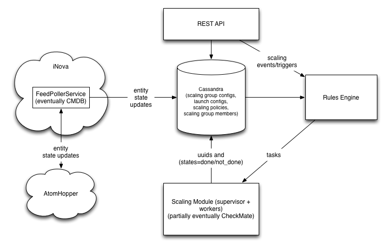

=====================
Architecture MVP v1.0
=====================

"The glue between monitoring and workflow"
-- David Reid, Esquire

MVP Scope
---------

* Scaling scope:
    * spin up servers given a particular launch config (image, flavor, etc.)
    * add server to load balancer
    * customer webhook when server setup is done
    * optional/optimal (network set up, block storage set up, run setup script)
* Auto scope:
    * never exceed min and max server configs
    * scale based on scaling policy
        * user-force scaling event policy (these should be enabled by default)
        * scheduling policy
        * maas alarm trigger policiy

Stack Diagram
-------------
.. image:: stack_diagram.png

Code/Architecture Diagram
-------------------------

FeedPollerService
^^^^^^^^^^^^^^^^^
This service polls AtomHopper (and hence needs to live in iNova) for updated
server events, and pushes said events to the rest of the autoscale system.
This is so autoscale can be aware more promptly of server errors and outages.

Eventually this system will hopefully be replaced by CMDB (inventory), or a
modified AtomHopper push service.

Scaling Module
^^^^^^^^^^^^^^
This module actually executes spinning up a server and spinning down a server.
The supervisor needs to keep track of the status of the spinning up and
spinning down process, and keeps the rest of the system apprised of pending
servers.

The worker accepts tasks for spinning up servers/hooking up load balancers and
other entities.  This part will hopefully be replaced by Checkmate (workflow).

Rules Engine
^^^^^^^^^^^^
TBD

Cassandra
^^^^^^^^^
This will be represented by the models module for interacting with the store.
Each model has an interface, so if it's necessary to replace Cassandra with
another store, the interface should be the same.

* There's already groups inside Rackspace working on full workflow (and that's a big problem of itself)
* MaaS already gives us a lot of monitoring and event-processing
* Customers can create a custom image that will handle the details of running chef, adding the server to the load balancer once it's done, etc.  This is how AWS works, more or less.
* It is assumed that the user is either going to manually handle scaling of the data storage or use DBaaS/CloudFiles for persistance.  There are products out there that will scale in a more complex fashion, but...

Config schemas
--------------
TBD
