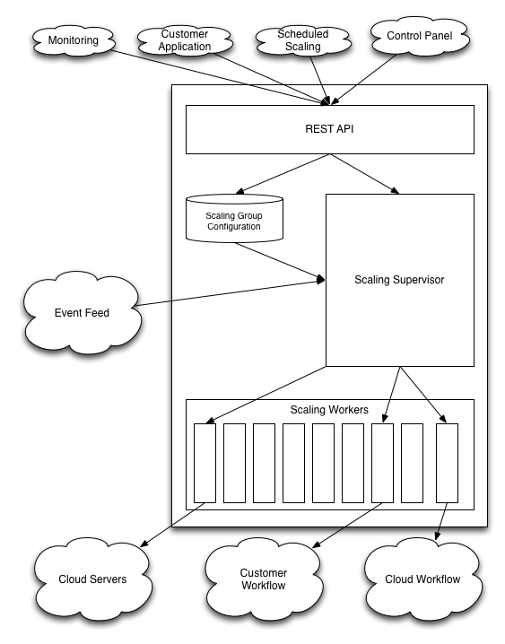
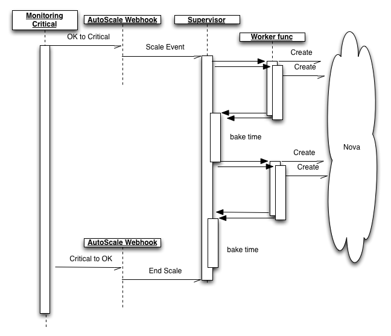

===============
Architecture
===============

"The glue between monitoring and workflow"
-- David Reid, Esquire

Important thoughts
------------------

* Properly provisioning a server is both complicated and time-consuming.  Especially if you start from
  a stock image (e.g. Ubuntu 10.04 LTS).  Image loading is very much necessary and requiring the user
  to self-provision makes the system much simpler.
* Large custom images can take a long time.  Small images can usually spin up fairly quickly.  Only so
  much we can do about this, however.
* Sometimes OpenStack fires up images and they end up in error state.
* OpenStack Personalities let you do things that AWS won't to make the job of configuring instances a
  bit easier.

Architecture
------------

Inputs
------

* User input to configure scaling groups
* Scale-up/Scale-down events (produced by a Monitoring alert, by a scheduler, or by the customer)

Scaling Supervisor
------------------

* Checks the validity of the event against the scaling group (Or not, if the user forces a scale)
* 'debounces' scaling events
* Hands scaling job to the workers
* 'Circles back' to add/remove additional servers if the state doesn't transition back to OK
* Allows for re-running of crashed/restarted worker events

Stored Data
------------

.. tocTree::
    :maxdepth: 2

    data_flow

Scaling Worker
--------------

* Server creation requests against Nova
* Triggering customer workflow via webhook
* Triggering eventual workflow systems

.. toctree::
    :maxdepth: 2

    scaling_workers

User-extensibility
------------------

* Can manually control the levels via overrides and let us handle spin-up/spin-down
* Can manually insert scale-up/scale-down events from user's monitor system
* Can replace our workflow system with a simple webhook.

How not to screw things up for our other teams
----------------------------------------------

* We cannot leave server-droppings.  Billing will hate us if they have to comp servers because we lost
  track of them and left them running
* We cannot destroy servers that we do not own by accident.
* We cannot exacerbate a Nova issue.  Remember the EBS outage on Amazon a year or two ago where they
  triggered a bunch of automated steps that turned a minor outage into a major one?  Yeah.  If a colo
  is experiencing issues, that might cause everybody's auto-scaling events to trigger, which then means
  that we're going to start firing up a bunch of servers, which then means that we're going to make the
  Nova cluster experience additional load, which then means that Nova's performance might continue to
  decline, which then means that a 5 minute blip turns into a 2 day outage.  Some of these measures
  might be disturbingly brute-force and painful (e.g. a kill-switch to pause scaling-up in a given colo)
  but we've got to do them.

Prior art
---------

* AWS AutoScale
* MS Azure Scaling
* RightScale
* Scalr

Fine-grained access control story
---------------------------------

**Suggested permissions possible**

* CRUD scaling groups
* Manually trigger scale-up/scale-down/rebuild tasks

PQ, dreid, & Ken discussed this briefly. If you impersonate the user who created the group, this creates
a problem if some company hires J. Junior Sysadmin to manage their servers, then replaces him with S.
Second Sysadmin a year later.  Suddenly, J. Junior Sysadmin's account has been deleted and you cannot
scale up or down, mysteriously.  Seems better to talk to the cloud APIs as the underlying account and
document that giving a user permission to CRUD scaling groups means that they will be able to create and
destroy a certain set of servers and adjust a certain set of load balancers because, while it seems a
little weird, it won't cause weird issues a year later and won't actually grant the ability to randomly
edit servers otherwise.
