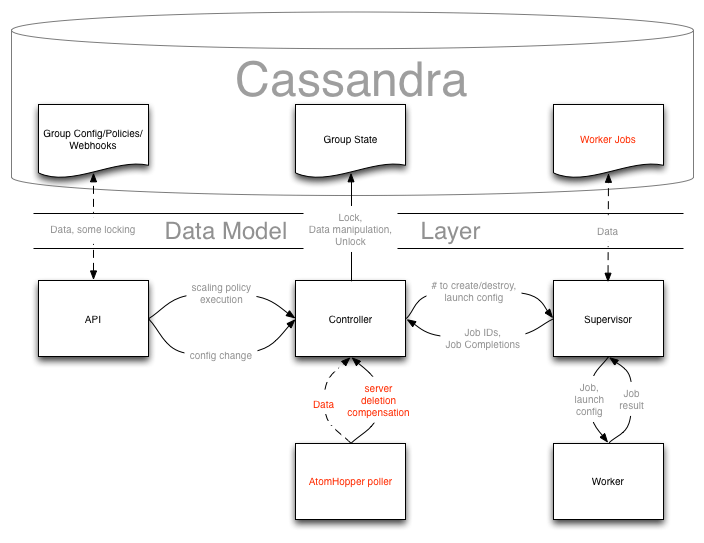

=========
Data Flow
=========

Diagram
-------

User-specified information
--------------------------

This is the information that the user provides that define the hows and the
scope of the scaling group.

* the scaling group config, containing metadata, the name, and the min/max
  number of servers
* the scaling group launch config (information on how to set up a server)
* the scaling policies associated with the group
* the webhooks that allow the scaling policies to be executed.

Access
^^^^^^

The user-specified information is accessed and modified through the model
store.  The main user of the model store is the REST API, but the controller
also uses it to access the config (to enforce limits on how many servers can
be started or shut down) and the launch config (to actually tell the launch
config to start servers).

Group State information
-----------------------

This is the information that autoscaling generates to keep track of which
entities are part of the scaling group.

* the ids of the entities that are already up and running (active)
* the ids, or job ids, of the entities that are being spun up (pending)

Access
^^^^^^

The group state information is accessed and modified mainly through the
controller, although the model store may read from this information to present
to the user.

Every controller action should be atomic, so any controller will first acquire
a lock before modifying or reading any information, and then it will release
the lock.  Note that the model reading state information from the group state
will not require any lock interaction.

Job State information (tentative)
---------------------------------

This is a store for supervisors to coordinate/keep track of the statuses of
jobs allocated to workers.

Access
^^^^^^

Only supervisors can access or modify this information.  Whether or not to
lock TBD.

Example Scenarios
-----------------

User executes policy
^^^^^^^^^^^^^^^^^^^^

* The model store looks up the policy in Cassandra, and tells the controller
  to execute said policy

* The controller acquires a lock

* The controller looks up config information, modifies the desired change by
  making sure the final number of servers conforms to the constraints specified
  by the config.  If the change is not zero, it tells the supervisor that this
  change should be made (possibly also passing the supervisor the launch config,
  if the change is positive).

  It then stores the job IDs from the supervisor as pending servers.

* The controller releases the lock

* The supervisor starts X number of workers to implement the change, recording
  the state of the job(s) in Cassandra.

* As each job finishes, the supervisor tells the controller that the job has
  been completed.

* The controller acquires a lock

* The controller removes the job from pending and places a server ID in active

* The controller releases the lock

User modifies the config
^^^^^^^^^^^^^^^^^^^^^^^^

* The model store updates the config, and tells the controller that the config
  has been modified

* The controller acquires a lock

* The controller looks up config information, modifies the desired change (which
  is zero) by making sure the final number of servers conforms to the
  possibly new constraints specified by the config.  If this change is anything
  other than zero, it tells the supervisor that this change should be made
  (possibly also passing the supervisor the launch config, if the change is
  positive).

  It then stores the job IDs from the supervisor as pending servers.

* The controller releases the lock

* See above scenario for the case of the change being non-zero.

User deletes a server fron Nova
^^^^^^^^^^^^^^^^^^^^^^^^^^^^^^^

* The AtomHopper poller notices that a server has been deleted, and notifies
  the controller.

* The controller looks up/verifies which group the server belongs to.

* The controller acquires a lock

* The controller looks up config information, modifies the desired change (which
  is plus one, to make up for the deleted server) by making sure the final
  number of servers conforms to the possibly new constraints specified by the
  config.  etc. etc. - please see above scenarios
