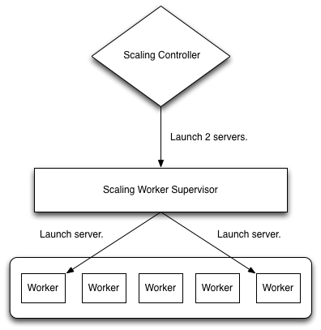

===============
Scaling Workers
===============

Scaling Workers are responsible for executing a launch configuration to add a
single instance to a scaling group.

Scaling Workers are coordinated by a Scaling Supervisor which will be responsible
for figuring out how many workers are needed, and preparing the launch
configuration for the workers.  The Scaling Supervisor will also be responsible
for determining if a failed worker's scaling tasks should be retried.

Diagram
-------

Goals
-----

Homogenous Processes
~~~~~~~~~~~~~~~~~~~~

Scaling workers are homogenous, any scaling worker should be able to handle
any type of launch configuration.

Each scaling supervisor should also be able to handle updating the status of
any job even those originally started by another supervisor.

Work Distribution
~~~~~~~~~~~~~~~~~

Most probably work distribution will be handled via RabbitMQ.  All scaling
workers will subscribe to a common queue to receive work and publish status
messages to a well known topic so that any scaling supervisor may update the state.

Distributed Job State
~~~~~~~~~~~~~~~~~~~~~

Launch configurations may be complex multiphase processes which require
coordination between several external services.  Worker processes should be free
to fail at any point in the execution of any number of jobs, and an arbitrary
supervisor should be able to clean up and re-execute orphaned jobs.

Therefor it is best if job state is stored in an easily distributed system
such as Cassandra.  And workers should frequently update their job state.

Isolation & Error Recovery
~~~~~~~~~~~~~~~~~~~~~~~~~~

The scaling worker should not maintain persistent state, and should not
interact directly with the database.  It should report the current status of
each task to the scaling supervisor who will persistent the state so that in the
case of failure the supervisor can control teardown of any resources created by
the failed task.
